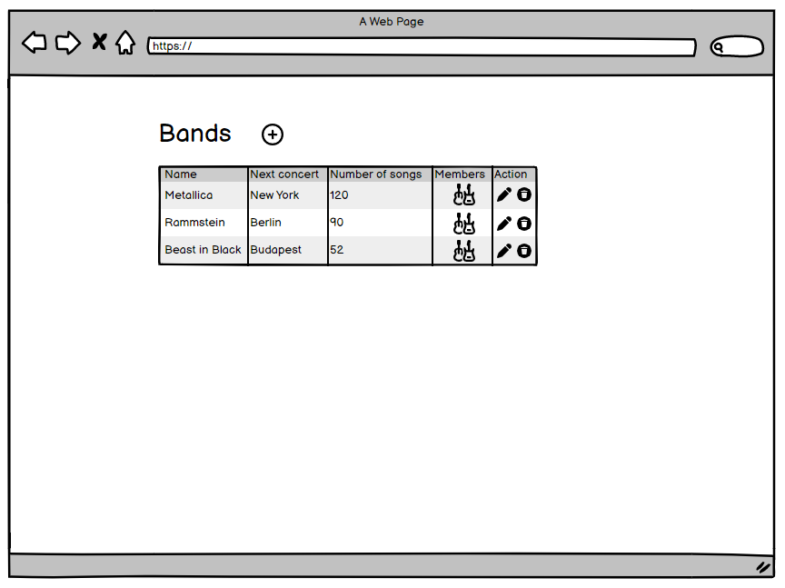
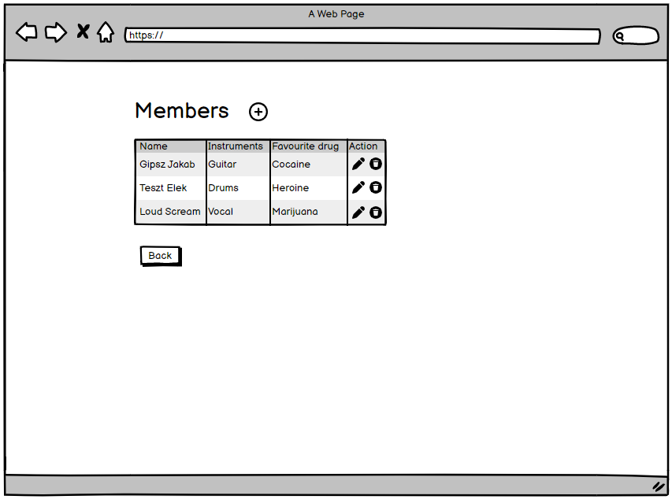
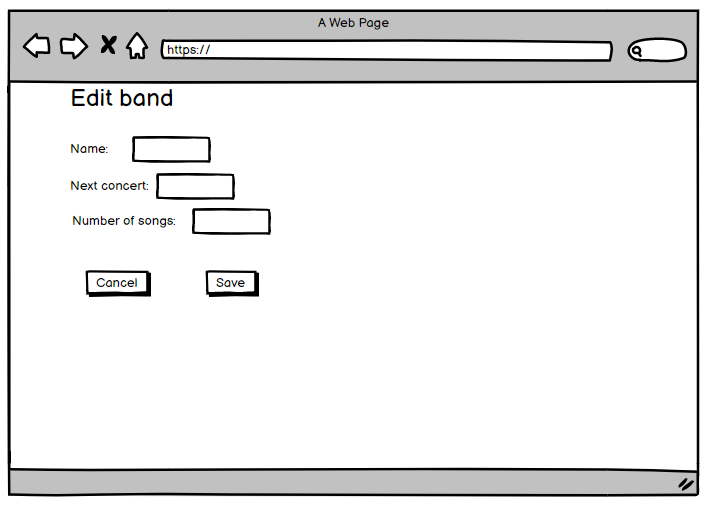
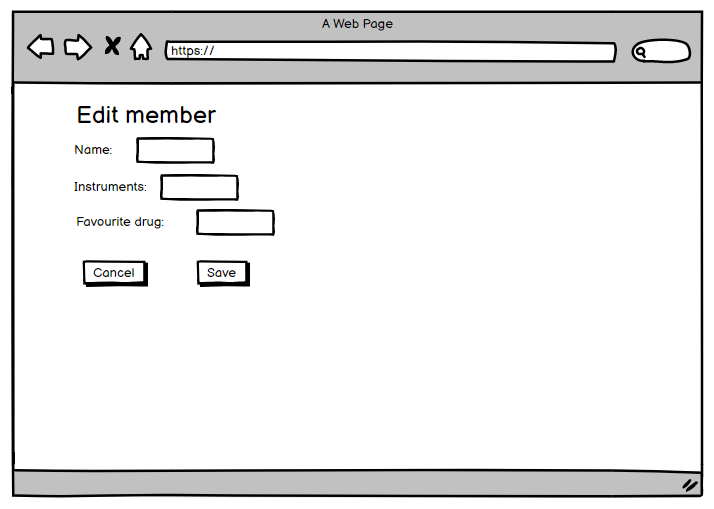

# Szerver oldali Javascript házi feladat specifikáció

Név: Taska Tamás

Neptun: RQGZH4

# Alapötlet

Egy olyan rendszert szeretnék megvalósítani, ami zenekarok adatait, és bennük játszó zenészek adatait tárolja. Ehhez 2 különböző entitásra lesz szükségem, amik tárolják a megfelelő adatokat. A zenészeknek van nevük, hangszerük valamint kedvenc tudatmódosító szerük. Az együtteseknek is van nevük, egy következő koncert helyszínük, kiadott zeneszámok száma, valamint a tagok listája.

# Nézetek

Összesen 4 nézetet terveztem megvalósítani az alkalmazáshoz, ezek a következők:
- Bandák listázása
- Banda módosítása
- Egy bandához tartozó tagok listázása
- Egy bandatag módosítása

## Bandák listázása

Az oldal táblázatszerűen megjeleníti az adatbázisban eltárolt bandákat és adataikat. 
Az utolsó előtti oszlopban található ikonra kattintva átkerülünk a másik nézetre, ahol a bandához tartozó tagokat nézhetjük meg.
A táblázat sorainak utolsó oszlopában található ikonok segítségével módosítható valamint törölhető az adott banda. 
A cím melletti plusz ikonra kattintva új bandát hozhatúnk létre.

## Tagok listázása

Az oldal táblázatszerűen megjeleníti az adatbázisban eltárolt bandatagokat és adataikat.
A táblázat sorainak utolsó oszlopában található ikonok segítségével módosítható valamint törölhető az adott tag.
A cím melletti plusz ikonra kattintva új tagot hozhatúnk létre.
A táblázat alatti gombra kattintva visszatérünk a bandák listájához.

## Banda módosítása

Az oldal egy űrlapot jelenít meg, amelyen a banda adatait módosíthatjuk.
Az űrlap alatti "Cancel" gombra kattintva visszatérünk a bandák listájához.
Az űrlap alatti "Save" gombra kattintva a módosításokat elmentjük az adatbázisba.
Ez az űrlap jelenik meg új banda felvételekor is.

## Tag módosítása

Az oldal egy űrlapot jelenít meg, amelyen a tag adatait módosíthatjuk.
Az űrlap alatti "Cancel" gombra kattintva visszatérünk a tagok listájához.
Az űrlap alatti "Save" gombra kattintva a módosításokat elmentjük az adatbázisba.
Ez az űrlap jelenik meg új tag felvételekor is.
